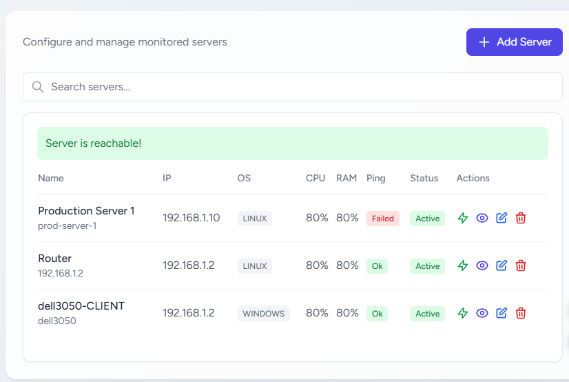
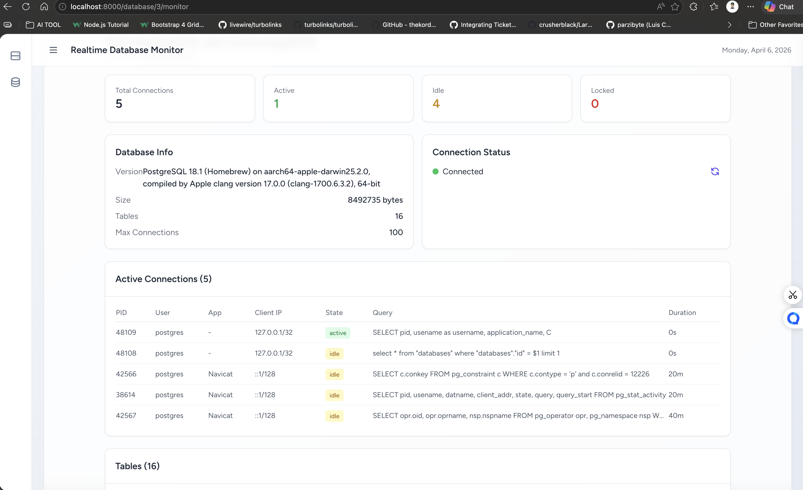

# APPS-MONITORING (Laravel 13)

Advanced Server and Database Monitoring System with Multi-Tenant Architecture, Role-Based Access Control (RBAC), and Real-time Dashboard.

## 🚀 Key Features




### 1. Multi-Tenant Architecture
- **Hierarchical Structure**: Organisation → Branch → Team.
- **Data Isolation**: Automatic data filtering using Eloquent `TenantScope`.
- **Management**: Full CRUD for Organisations and Branches with dedicated management views.

### 2. Role-Based Access Control (RBAC)
- Powered by `spatie/laravel-permission`.
- **Roles**: Admin (Org), Branch Manager, Line Manager, Supervisor, and User.
- **Isolation**: Roles are hierarchical but strictly isolated per organization.

### 3. Monitoring Capabilities
- **Server Monitoring**: Real-time tracking of CPU, RAM, Disk, and Network usage.
- **Database Monitoring**: Support for PostgreSQL, MySQL, SQL Server, and Oracle.
- **Real-time PostgreSQL Monitor**: Deep dive into active connections, query duration, and table sizes.

### 4. UI/UX (Modern & Responsive)
- ✨ **Modern Glassmorphism Login**: Premium gradient background with animated particles, floating glass form card, neon glow inputs, shimmer button effects, floating labels, and responsive design.
- **Horizon UI Theme**: Clean, modern admin dashboard style.
- **Animated Header**: Real-time clock (WIB) and dynamic date positioning.
- **Collapsible Sidebar**: Space-efficient navigation with tooltips.
- **App Versioning**: Automatic version tracking displayed in the sidebar footer.

## 🛠️ Requirements & Database Drivers

To monitor different database types, ensure the corresponding PHP extensions are enabled in your `php.ini`:

- **PostgreSQL / EDB**: `extension=pdo_pgsql`
- **SQL Server (MSSQL)**: `extension=pdo_sqlsrv` (Windows) or `extension=pdo_dblib` (Linux)
- **MySQL / Cloud SQL**: `extension=pdo_mysql`
- **Oracle**: `extension=pdo_oci`

### Troubleshooting Connection Errors
- **Connection Refused**: Check if the database server is running and configured to accept remote connections (e.g., `postgresql.conf` for Postgres).
- **Driver Not Found**: Ensure the extension is enabled and PHP has been restarted.
- **WIB Time**: All logs and charts are synchronized to Jakarta Time (WIB).

## 🛠️ Tech Stack

- **Framework**: Laravel 13 (PHP 8.2+)
- **Frontend**: Livewire 3 + Tailwind CSS
- **Database**: PostgreSQL
- **RBAC**: Spatie Laravel Permission
- **Timezone**: Asia/Jakarta (WIB)

## 📥 Installation

```bash
# Clone the repository
git clone https://github.com/harys-rifai/APPS-MONITORING.git

# Install PHP dependencies
composer install

# Install JS dependencies
npm install && npm run build

# Configure Environment
cp .env.example .env
# Update DB_CONNECTION=pgsql and your credentials in .env

# Run Migrations & Seeders (Required for RBAC & Initial Org)
php artisan migrate:fresh --seed

# Start Application
php artisan serve
```

## 🔐 Default Admin Login

- **Email**: `harys@google.com`
- **Password**: `xcxcxc`
- **Role**: Super Admin (Organisation Level)

## 📈 Application Versioning
The system tracks updates in the `app_versions` table. The current version is displayed at the bottom of the left sidebar.

- **v1.0.8**: Fix Livewire modal issues and improve button actions, add flash message timeout 2s.
- **v1.0.7**: Fix pagination and seed 40 data per table.
- **v1.0.6**: Horizon UI theme adoption.
- **v1.0.5**: Soft UI styling improvements.
- **v1.0.4**: Add clock animation on header/navbar.
- **v1.0.3**: Add multi-language support (EN/ID) and clock with WIB timezone.
- **v1.0.2**: Add scheduled ping job every 15 minutes.
- **v1.0.1**: Add ping OK/Failed status to servers.
- **v1.1.1**: Idempotent Seeding & Auto-installation setup.
- **v1.1.0**: Multi-Database Monitoring (Postgres, MSSQL, MySQL, Oracle), Real-time stats, Detailed Table Metrics.
- **v1.0.0**: Initial Multi-tenant Rebuild.

## 📝 License
MIT License